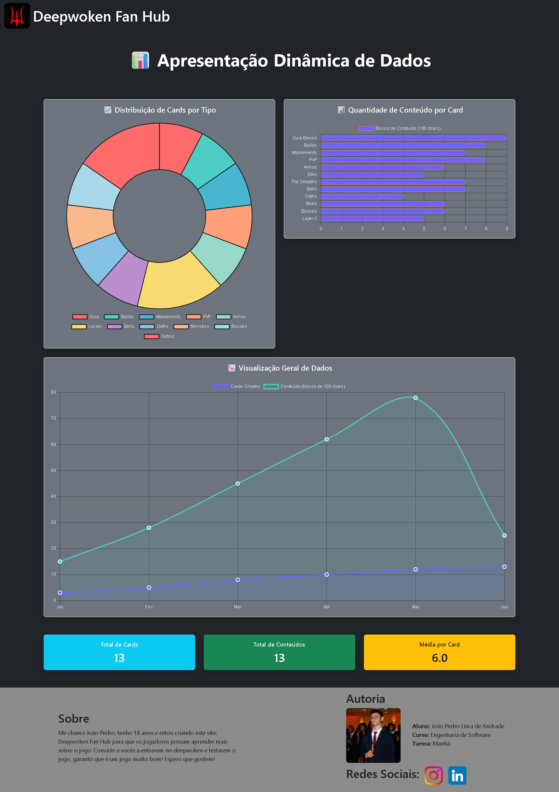

# Trabalho Prático 07 - Semanas 13 e 14

A partir dos dados cadastrados na etapa anterior, vamos trabalhar formas de apresentação que representem de forma clara e interativa as informações do seu projeto. Você poderá usar gráficos (barra, linha, pizza), mapas, calendários ou outras formas de visualização. Seu desafio é entregar uma página Web que organize, processe e exiba os dados de forma compreensível e esteticamente agradável.

Com base nos tipos de projetos escohidos, você deve propor **visualizações que estimulem a interpretação, agrupamento e exibição criativa dos dados**, trabalhando tanto a lógica quanto o design da aplicação.

Sugerimos o uso das seguintes ferramentas acessíveis: [FullCalendar](https://fullcalendar.io/), [Chart.js](https://www.chartjs.org/), [Mapbox](https://docs.mapbox.com/api/), para citar algumas.

## Informações do trabalho

- Nome: João Pedro Lima de Andrade
- Matricula: 885317
- Proposta de projeto escolhida:  5. Temas e Conteúdos Associados.
- Breve descrição sobre seu projeto: Deepwoken Fan Hub será uma aplicação web criada para a comunidade de deepwoken, onde será possivel visualizar informações importantes sobre o jogo, e os jogadores poderao interagir entre si de diversas maneiras.

**Print da tela com a implementação**

 Foi implementado gráficos que mostram alguns dados relevantes da minha aplicação web, como, a quantidade de conteúdo médio ( por 100 caracteres ) bem como o tipo dos conteúdos ( por gráfico de pizza) e um que mostra a quantidade de conteúdo em relação ao tempo, tudo dinanico, ao criar um novo item os graficos mudam.

<<  COLOQUE A IMAGEM TELA 1 AQUI >>

<<  COLOQUE A IMAGEM TELA 2 AQUI >>
